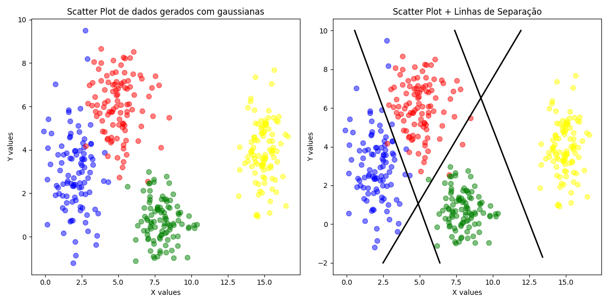
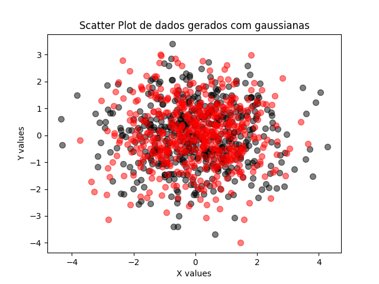
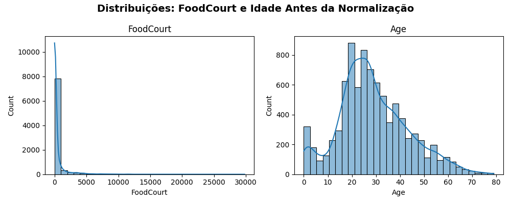

# Data Preparation & Analysis — Neural Networks

???+ info inline end "Edição"

    2025.2

This repository presents a focused, hands-on study on how **data generation and conditioning** shape neural network learning. The project was divided into three main parts:

1. generate and analyze **2D Gaussian** datasets;

2. create and visualize **multi-dimensional** data;

3. prepare a **real-world** dataset for a neural network with **tanh** activations in its hidden layers.

## Part 1: Exploring Class Separability in 2D

Understanding how data is distributed is the first design step before designing a network architecture.  
In this part, I generated and visualized a two-dimensional dataset with four Gaussian classes to explore how data distribution affects the complexity of the decision boundaries a neural network would need to learn.

### Data Generation

First, I created a synthetic dataset with a total of 400 samples, divided equally among 4 classes (100 samples each). I used a Gaussian distribution to generate the points for each class based on the following parameters:

- **Class 0:** Mean = $[2, 3]$, Standard Deviation = $[0.8, 2.5]$
- **Class 1:** Mean = $[5, 6]$, Standard Deviation = $[1.2, 1.9]$
- **Class 2:** Mean = $[8, 1]$, Standard Deviation = $[0.9, 0.9]$
- **Class 3:** Mean = $[15, 4]$, Standard Deviation = $[0.5, 2.0]$

To generate the dataset, I utilized the function `numpy.random.multivariate_normal`, which allows for the creation of samples from a multivariate normal distribution. It's documentation can be found [here](https://numpy.org/doc/2.2/reference/random/generated/numpy.random.multivariate_normal.html). The code bellow is the one I used to generate the data:

```python
import numpy as np

np.random.seed(2)


def create_data(N, mean, std_dev):
    cov = np.diag(std_dev)
    x, y = np.random.multivariate_normal(mean, cov, N).T
    return x, y


x1, y1 = create_data(100, [2, 3], [0.8, 2.5])
x2, y2 = create_data(100, [5, 6], [1.2, 1.9])
x3, y3 = create_data(100, [8, 1], [0.9, 0.9])
x4, y4 = create_data(100, [15, 4], [0.5, 2.0])
```

### Data Visualization

After that, I visualized the dataset using scatter plots. The first plot shows the raw data points colored by their respective classes, while the second plot includes lines that represent potential decision boundaries separating the classes. The complete code for generating and plotting the data is shown below:

```pyodide install="numpy,matplotlib"
import numpy as np

# https://numpy.org/doc/2.2/reference/random/generated/numpy.random.multivariate_normal.html

np.random.seed(2)


def create_data(N, mean, std_dev):
    cov = np.diag(std_dev)
    x, y = np.random.multivariate_normal(mean, cov, N).T
    return x, y


x1, y1 = create_data(100, [2, 3], [0.8, 2.5])
x2, y2 = create_data(100, [5, 6], [1.2, 1.9])
x3, y3 = create_data(100, [8, 1], [0.9, 0.9])
x4, y4 = create_data(100, [15, 4], [0.5, 2.0])

import matplotlib.pyplot as plt

plt.close('all')

fig, axes = plt.subplots(1, 2, figsize=(12, 6))

axes[0].scatter(x1, y1, alpha=0.5, s=50, c="blue")
axes[0].scatter(x2, y2, alpha=0.5, s=50, c="red")
axes[0].scatter(x3, y3, alpha=0.5, s=50, c="green")
axes[0].scatter(x4, y4, alpha=0.5, s=50, c="yellow")
axes[0].set_title("Scatter Plot de dados gerados com gaussianas")
axes[0].set_xlabel("X values")
axes[0].set_ylabel("Y values")

axes[1].scatter(x1, y1, alpha=0.5, s=50, c="blue")
axes[1].scatter(x2, y2, alpha=0.5, s=50, c="red")
axes[1].scatter(x3, y3, alpha=0.5, s=50, c="green")
axes[1].scatter(x4, y4, alpha=0.5, s=50, c="yellow")

axes[1].plot([6.38, 0.56], [-2, 10], c="black", linewidth=2)
axes[1].plot([11.92, 2.5], [10, -2], c="black", linewidth=2)
axes[1].plot([13.4, 7.4], [-1.7, 10], c="black", linewidth=2)

axes[1].set_title("Scatter Plot + Linhas de Separação")
axes[1].set_xlabel("X values")
axes[1].set_ylabel("Y values")

plt.tight_layout()
plt.show()

```

The output is shown below:



### Analysis of Class Separability

The four classes form well-defined Gaussian clusters. The blue one sits on the left with moderate vertical spread. The red is above and slightly to the right of blue. Green lies farther right and lower, with a tighter cloud. Finally, Yellow is isolated on the far right. There’s light overlap between blue and red and a narrow diagonal corridor of conflict between red and green. Yellow barely mixes with others.

Considering that, it would not be possible to create a simple linear decision boundary that perfectly separates all four classes due to the overlaps and proximity of some classes. A neural network would likely need to learn more complex, non-linear boundaries to effectively classify the data points.

## Part 2: Non-Linearity in Higher Dimensions

Simple neural networks (like a Perceptron) can only learn linear boundaries. Deep networks excel when data is not linearly separable.

### Data Generation in Higher Dimensions

To explore this, I generated a synthetic dataset in a higher-dimensional space where classes are not linearly separable. I generated 2 classes,
each onde with 500 samples. The parameters used for generating the data were:

- **Class A:**

  **Mean vector**

  $$
  \mu_A = [0, 0, 0, 0, 0]
  $$

  **Covariance matrix**

  $$
    \Sigma_A =
    \begin{pmatrix}
    1.0 & 0.8 & 0.1 & 0.0 & 0.0 \\\
    0.8 & 1.0 & 0.3 & 0.0 & 0.0 \\\
    0.1 & 0.3 & 1.0 & 0.5 & 0.0 \\\
    0.0 & 0.0 & 0.5 & 1.0 & 0.2 \\\
    0.0 & 0.0 & 0.0 & 0.2 & 1.0
    \end{pmatrix}
  $$

- **Class B:**

  **Mean vector**

  $$
  \mu_B = [1.5, 1.5, 1.5, 1.5, 1.5]
  $$

  **Covariance matrix**

  $$
  \Sigma_B = \begin{pmatrix}
  1.5 & -0.7 & 0.2 & 0.0 & 0.0 \\\
  -0.7 & 1.5 & 0.4 & 0.0 & 0.0 \\\
  0.2 & 0.4 & 1.5 & 0.6 & 0.0 \\\
  0.0 & 0.0 & 0.6 & 1.5 & 0.3 \\\
  0.0 & 0.0 & 0.0 & 0.3 & 1.5
  \end{pmatrix}
  $$

Using the same `numpy.random.multivariate_normal` function, I generated the samples for both classes. The code used is shown below:

```python
import numpy as np

mean_A = np.zeros(5)

Sigma_A = np.array(
    [
        [1.0, 0.8, 0.1, 0.0, 0.0],
        [0.8, 1.0, 0.3, 0.0, 0.0],
        [0.1, 0.3, 1.0, 0.5, 0.0],
        [0.0, 0.0, 0.5, 1.0, 0.2],
        [0.0, 0.0, 0.0, 0.2, 1.0],
    ]
)

mean_B = np.array([1.5, 1.5, 1.5, 1.5, 1.5])

Sigma_B = np.array(
    [
        [1.5, -0.7, 0.2, 0.0, 0.0],
        [-0.7, 1.5, 0.4, 0.0, 0.0],
        [0.2, 0.4, 1.5, 0.6, 0.0],
        [0.0, 0.0, 0.6, 1.5, 0.3],
        [0.0, 0.0, 0.0, 0.3, 1.5],
    ]
)

ptsA = np.random.multivariate_normal(mean_A, Sigma_A, 500)
ptsB = np.random.multivariate_normal(mean_B, Sigma_B, 500)
```

### Dimensionality Reduction & Visualization

Since it's not possible to plot a 5D graph, I had to reduce the dimensionality of the data. To visualize the high-dimensional data, I applied Principal Component Analysis (PCA) to reduce the data to 2 dimensions.

```python
# PCA Implementation
sub_a = ptsA - mean_A
sub_b = ptsB - mean_B
stdA = np.sqrt(np.diag(Sigma_A))
stdB = np.sqrt(np.diag(Sigma_B))
ptsA_ = sub_a / stdA
ptsB_ = sub_b / stdB


C_A = (1 / 500) * (ptsA_.T @ ptsA_)
C_B = (1 / 500) * (ptsB_.T @ ptsB_)

eigenvalues_A, eigenvectors_A = np.linalg.eig(C_A)
eigenvalues_B, eigenvectors_B = np.linalg.eig(C_B)

sorted_indices_A = np.argsort(eigenvalues_A)[::-1]
sorted_indices_B = np.argsort(eigenvalues_B)[::-1]

k = 2
W_A = eigenvectors_A[:, sorted_indices_A[:k]]
W_B = eigenvectors_B[:, sorted_indices_B[:k]]

YA = ptsA_ @ W_A
YB = ptsB_ @ W_B
```

Finally, I plotted the 2D projections of both classes to visualize their distribution after dimensionality reduction. The full code can be run below:

```pyodide install="numpy,matplotlib"
import numpy as np

mean_A = np.zeros(5)

Sigma_A = np.array(
    [
        [1.0, 0.8, 0.1, 0.0, 0.0],
        [0.8, 1.0, 0.3, 0.0, 0.0],
        [0.1, 0.3, 1.0, 0.5, 0.0],
        [0.0, 0.0, 0.5, 1.0, 0.2],
        [0.0, 0.0, 0.0, 0.2, 1.0],
    ]
)

mean_B = np.array([1.5, 1.5, 1.5, 1.5, 1.5])

Sigma_B = np.array(
    [
        [1.5, -0.7, 0.2, 0.0, 0.0],
        [-0.7, 1.5, 0.4, 0.0, 0.0],
        [0.2, 0.4, 1.5, 0.6, 0.0],
        [0.0, 0.0, 0.6, 1.5, 0.3],
        [0.0, 0.0, 0.0, 0.3, 1.5],
    ]
)

ptsA = np.random.multivariate_normal(mean_A, Sigma_A, 500)
ptsB = np.random.multivariate_normal(mean_B, Sigma_B, 500)

sub_a = ptsA - mean_A
sub_b = ptsB - mean_B
stdA = np.sqrt(np.diag(Sigma_A))
stdB = np.sqrt(np.diag(Sigma_B))
ptsA_ = sub_a / stdA
ptsB_ = sub_b / stdB


C_A = (1 / 500) * (ptsA_.T @ ptsA_)
C_B = (1 / 500) * (ptsB_.T @ ptsB_)

eigenvalues_A, eigenvectors_A = np.linalg.eig(C_A)
eigenvalues_B, eigenvectors_B = np.linalg.eig(C_B)

sorted_indices_A = np.argsort(eigenvalues_A)[::-1]
sorted_indices_B = np.argsort(eigenvalues_B)[::-1]

k = 2
W_A = eigenvectors_A[:, sorted_indices_A[:k]]
W_B = eigenvectors_B[:, sorted_indices_B[:k]]

YA = ptsA_ @ W_A
YB = ptsB_ @ W_B

import matplotlib.pyplot as plt

plt.close('all')
plt.scatter(YA[:, 0], YA[:, 1], alpha=0.5, s=50, c="black")
plt.scatter(YB[:, 0], YB[:, 1], alpha=0.5, s=50, c="red")
plt.title("Scatter Plot de dados gerados com gaussianas")
plt.xlabel("X values")
plt.ylabel("Y values")
plt.show()
```

The resulting plot is shown below:



### Analysis of the plot

Based on the 2D projection, the two classes largely co-occupy the same region. The red class forms a tighter, roughly elliptical core around the origin, whereas the black class is more diffuse and spreads farther in all directions. This means their centers are similar but their dispersion/covariance differs, leading to substantial overlap and no obvious linear split. Because of that, a multi-layer neural network would be better than a simple linear model, since it can combine multiple simple cuts to form a curved, flexible boundary that better follows the different shapes and separates the classes more accurately.

## Part 3: Preparing Real-World Data for a Neural Network

After all that preparation with synthetic data, it was important to move on to a real-world dataset: the [Spaceship Titanic](https://www.kaggle.com/competitions/spaceship-titanic) dataset from Kaggle. The objective was, using this data, make the necessary preprocessing to make it suitable for a neural network that uses the hyperbolic tangent activation function in its hidden layers.

???+ warning inline end "Important Note"

    To do this part, I used as reference the [Spaceship Titanic: A complete guide](https://www.kaggle.com/code/samuelcortinhas/spaceship-titanic-a-complete-guide#Data)

### Description of the Dataset

The Spaceship Titanic challenge asks you to build a binary classifier that predicts whether each passenger was transported to an alternate dimension after a spacetime-anomaly collision.

**Features descriptions**:

- PassengerId - A unique Id for each passenger. Each Id takes the form gggg_pp where gggg indicates a group the passenger is travelling with and pp is their number within the group. People in a group are often family members, but not always.

- HomePlanet - The planet the passenger departed from, typically their planet of permanent residence.

- CryoSleep - Indicates whether the passenger elected to be put into suspended animation for the duration of the voyage. Passengers in cryosleep are confined to their cabins.

- Cabin - The cabin number where the passenger is staying. Takes the form deck/num/side, where side can be either P for Port or S for Starboard.

- Destination - The planet the passenger will be debarking to.

- Age - The age of the passenger.

- VIP - Whether the passenger has paid for special VIP service during the voyage.
  RoomService, FoodCourt, ShoppingMall, Spa, VRDeck - Amount the passenger has billed at each of the Spaceship Titanic's many luxury amenities.

- Name - The first and last names of the passenger.

- Transported - Whether the passenger was transported to another dimension. This is the target, the column you are trying to predict.

**Analizing Missing Values**

```pyodide install="pandas,matplotlib"
import pandas as pd
import matplotlib.pyplot as plt

df = pd.read_csv("https://raw.githubusercontent.com/HenriqueFBadin/Data-Preparation-and-Analysis-for-Neural-Networks/main/docs/assets/data/test.csv")

print("Missing values per column:\n")
print(df.isnull().sum())
```

### Preprocess the Data:

Therefore, I proceeded to clean and transform the data to make it suitable for a neural network. As the tanh activation function produces outputs in the range [-1, 1], I ensured that the input data was scaled appropriately for stable training. The complete code used for data preprocessing is shown below:

```pyodide install="pandas,matplotlib"
import pandas as pd
import matplotlib.pyplot as plt

df = pd.read_csv("https://raw.githubusercontent.com/HenriqueFBadin/Data-Preparation-and-Analysis-for-Neural-Networks/main/docs/assets/data/test.csv")

print("Missing values per column:\n")
print(df.isnull().sum())

print("Unique values per column:\n")
print(df.nunique())

print("\nData types of each column:\n")
print(df.dtypes)

y = df["Transported"]
X = df.drop(columns=["Transported"])

num_cols = X.select_dtypes(include=["float64"]).columns
cat_cols = X.select_dtypes(include=["object", "bool"]).columns

X[num_cols] = X[num_cols].fillna(X[num_cols].median())

for c in cat_cols:
    moda = X[c].mode(dropna=True)
    X[c] = X[c].fillna(moda.iloc[0] if not moda.empty else "Unknown")

dummies = pd.get_dummies(X[["HomePlanet", "Destination"]])
dummies = dummies.astype(int)
X_enc = X.drop(columns=["HomePlanet", "Destination"]).join(dummies)

X_enc[["Deck", "CabinNum", "Side"]] = (
    X_enc["Cabin"].astype(str).str.split("/", expand=True)
)
dataframe = X_enc.drop(columns=["Cabin"])

dummies = pd.get_dummies(dataframe[["CryoSleep", "VIP", "Side"]])
dummies = dummies.astype(int)
dataframe = dataframe.drop(columns=["CryoSleep", "VIP", "Side"]).join(dummies)

print("\nEstado intermediário do dataframe:\n")
print(dataframe.head())

dummies = pd.get_dummies(dataframe["Deck"], prefix="Deck", dummy_na=False, dtype=int)
dataframe = pd.concat([dataframe.drop(columns=["Deck"]), dummies], axis=1)

dataframe["CabinNum"] = pd.to_numeric(dataframe["CabinNum"], errors="coerce")
dataframe["CabinNum"] = dataframe["CabinNum"].fillna(dataframe["CabinNum"].median())
cont_cols = [
    "Age",
    "RoomService",
    "FoodCourt",
    "ShoppingMall",
    "Spa",
    "VRDeck",
    "CabinNum",
]
```

### Visualizing the Preprocessed Data

Finally, I visualized the distribution of the numerical features to ensure they were appropriately scaled for a neural network using the tanh activation function. The histograms below show that the features are now centered around zero and fall within a range suitable for tanh.

```python
fig, axes = plt.subplots(1, 2, figsize=(10, 4))

sns.histplot(dataframe["FoodCourt"], bins=30, kde=True, ax=axes[0])
axes[0].set_title("FoodCourt")

sns.histplot(dataframe["Age"], bins=30, kde=True, ax=axes[1])
axes[1].set_title("Age")

fig.suptitle(
    "Distribuições: FoodCourt e Idade Antes da Normalização",
    fontsize=14,
    fontweight="bold",
)
plt.tight_layout()
plt.show()

from sklearn.preprocessing import MinMaxScaler

scaler = MinMaxScaler(feature_range=(-1, 1))
dataframe[cont_cols] = scaler.fit_transform(dataframe[cont_cols])

fig, axes = plt.subplots(1, 2, figsize=(10, 4))

sns.histplot(dataframe["FoodCourt"], bins=30, kde=True, ax=axes[0])
axes[0].set_title("FoodCourt")

sns.histplot(dataframe["Age"], bins=30, kde=True, ax=axes[1])
axes[1].set_title("Age")


fig.suptitle(
    "Distribuições: FoodCourt e Idade Após a Normalização",
    fontsize=14,
    fontweight="bold",
)
plt.tight_layout()
plt.show()
```

The output is shown below:

**Before Normalization:**



**After Normalization:**


### Conclusion

That way, I successfully preprocessed the Spaceship Titanic dataset, handling missing values, encoding categorical variables, and normalizing numerical features to ensure compatibility with a neural network using the tanh activation function. This preprocessing is crucial for achieving stable and effective training of the model.

## References

- [Kaggle - Spaceship Titanic](https://www.kaggle.com/competitions/spaceship-titanic)
- [Spaceship Titanic: A complete guide](https://www.kaggle.com/code/samuelcortinhas/spaceship-titanic-a-complete-guide#Data)
- [Numpy Documentation - multivariate_normal](https://numpy.org/doc/2.2/reference/random/generated/numpy.random.multivariate_normal.html)
- [ANN-DL Course - Preprocessing](https://insper.github.io/ann-dl/classes/preprocessing/main)
