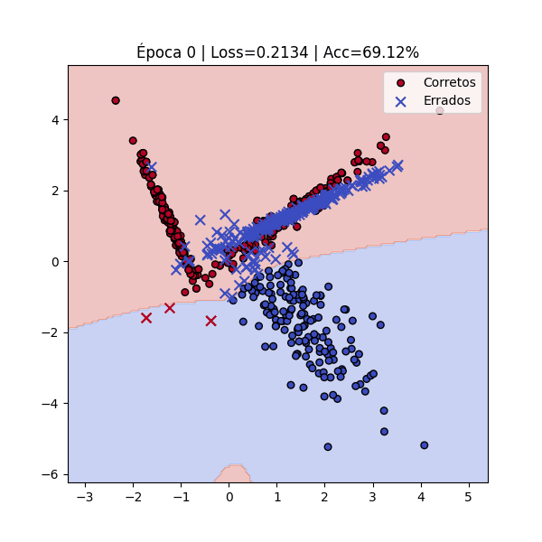

# Activity: Understanding Multi-Layer Perceptrons (MLPs)

???+ info inline end "Edição"

    2025.2

Nesta documentação são mostradas as realizações de quatro exercícios práticos de MLP que realizei ao longo do semestre. Cada exercício teve como objetivo aprofundar a compreensão sobre o funcionamento interno das redes neurais, desde o cálculo manual de forward pass e backpropagation até a implementação de MLPs para tarefas de classificação binária e multiclasse. A seguir, descrevo cada exercício, apresento os códigos utilizados e discuto os resultados obtidos.

## Exercício 1 — Cálculo manual de um MLP

Para o primeiro exercício considerei um MLP simples com 2 features de entrada, 2 neurônios em 1 camada oculta e 1 neurônio de saída. Para tal, utilizei a função de ativação `tanh` tanto para a camada oculta como para a camada de saída. A perda foi calculada usando o erro quadrático médio (MSE). Os pesos e vieses foram inicializados com valores fixos para facilitar a verificação dos cálculos.

Usei os seguintes valores:

- **Entrada `x`**: `[0.5, -0.2]`
- **Rótulo `y`**: `1`
- **Pesos `W1`** (camada oculta): `[[0.3, -0.1], [0.2, 0.4]]`
- **Vieses `b1`** (camada oculta): `[0.1, -0.2]`
- **Pesos `W2`** (camada de saída): `[[0.5, -0.3]]`
- **Vieses `b2`** (camada de saída): `[0.2]`
- **Taxa de aprendizado `η`**: `0.3`

Primeiro, calculei o forward pass para obter a predição `y_pred` e a perda `L`. Em seguida, realizei o backpropagation para calcular os gradientes dos pesos e vieses. Finalmente, atualizei os parâmetros usando o gradiente descendente. A execução completa do código está abaixo:

```pyodide install="numpy"
import numpy as np

x = np.array([0.5, -0.2])
y = 1
W1 = np.array([[0.3, -0.1], [0.2, 0.4]])
b1 = np.array([0.1, -0.2])
W2 = np.array([[0.5, -0.3]])
b2 = np.array([0.2])
eta = 0.3

def tanh(u):
    return (np.exp(2 * u) - 1) / (np.exp(2 * u) + 1)

# Forward
z1 = W1.dot(x) + b1
h1 = tanh(z1)
u2 = W2.dot(h1) + b2
y_pred = tanh(u2)
L = (y - y_pred)**2 / len(x)

# Backward
delL_dely_pred = -2 * (y - y_pred) / len(x)
dely_pred_du2 = 1 - y_pred**2
delL_delW2 = delL_dely_pred * dely_pred_du2 * h1
delL_delb2 = delL_dely_pred * dely_pred_du2
delL_delh1 = delL_dely_pred * dely_pred_du2 * W2
delh1_dz1 = 1 - h1**2
delL_delW1 = np.outer((delL_delh1 * delh1_dz1).reshape(-1), x)
delL_delb1 = (delL_delh1 * delh1_dz1)

# Update
W2_new = W2 - eta * delL_delW2
b2_new = b2 - eta * delL_delb2
W1_new = W1 - eta * delL_delW1
b1_new = b1 - eta * delL_delb1

print("z1 =", z1)
print("h1 =", h1)
print("u2 =", u2)
print("y_pred =", y_pred)
print("loss =", L)
print("grad W2 =", delL_delW2)
print("grad b2 =", delL_delb2)
print("grad W1 =\n", delL_delW1)
print("grad b1 =", delL_delb1)
print("W1 updated =\n", W1_new)
print("b1 updated =", b1_new)
print("W2 updated =", W2_new)
print("b2 updated =", b2_new)
```

## Exercício 2 — Classificação binária sintética

Para essa tarefa, criei um conjunto de 1000 dados sintético com duas classes. Usei a função `make_classification` do `scikit-learn` para gerar os dados, garantindo que cada classe tivesse uma distribuição diferente.

Gerei 500 pontos para a classe 0 com um único cluster e, separadamente, dois grupos de 250 pontos cada para a classe 1, de modo que ela ficasse com dois clusters. Todos os conjuntos foram combinados, resultando em um dataset com 2 features, ambas informativas (n_informative=2), sem atributos redundantes (n_redundant=0), e o random_state=42 garantiu a reprodutibilidade.

Por fim, ajustei class_sep para cerca de 1,3 e mantive flip_y=0 para evitar rótulos incorretos.

Implementei então um MLP simples com uma camada oculta de 12 neurônios (`tanh`) e uma saída com um neurônio (`tanh`). A função de perda foi a MSE, usada na etapa passada. O treinamento foi realizado por 500 épocas, com uma taxa de aprendizado de 0,05. Para chegar nesses valores, testei diferentes quantidades de neurônios e taxas de aprendizado, sem exagerar para manter a simplicidade. O código completo está abaixo:

```pyodide install="numpy,scikit-learn"
import numpy as np
from sklearn.datasets import make_classification
from sklearn.model_selection import train_test_split

n = 1000
X0, _ = make_classification(
    n_samples=n // 2,
    n_features=2,
    n_informative=2,
    n_redundant=0,
    n_clusters_per_class=1,
    n_classes=2,
    class_sep=1.3,
    random_state=42,
)
y0 = np.zeros(X0.shape[0], dtype=int)

X1a, _ = make_classification(
    n_samples=n // 4,
    n_features=2,
    n_informative=2,
    n_redundant=0,
    n_clusters_per_class=1,
    n_classes=2,
    class_sep=1.3,
    random_state=42,
)
X1b, _ = make_classification(
    n_samples=n - (n // 2 + n // 4),
    n_features=2,
    n_informative=2,
    n_redundant=0,
    n_clusters_per_class=1,
    n_classes=2,
    class_sep=1.3,
    random_state=42,
)
y1a = np.ones(X1a.shape[0], dtype=int)
y1b = np.ones(X1b.shape[0], dtype=int)

X = np.vstack([X0, X1a, X1b])
y = np.hstack([y0, y1a, y1b])

X_train, X_test, y_train, y_test = train_test_split(
    X, y, test_size=0.2, random_state=42, stratify=y
)

rng = np.random.default_rng(42)
W1 = rng.normal(0, 1, (12, 2)) / np.sqrt(2)
b1 = np.zeros(12)
W2 = rng.normal(0, 1, (1, 12)) / np.sqrt(12)
b2 = np.zeros(1)


def tanh(x):
    return np.tanh(x)


eta = 0.05
epochs = 500
y_train = y_train.reshape(-1, 1).astype(float)

for ep in range(1, epochs + 1):
    # forward
    z1 = X_train @ W1.T + b1
    h1 = tanh(z1)
    z2 = h1 @ W2.T + b2
    y_pred = tanh(z2)

    # loss (MSE)
    loss = np.mean((y_train - y_pred) ** 2)

    # backward
    grad_z2 = 2 * (y_pred - y_train) * (1 - y_pred**2) / len(X_train)
    grad_W2 = grad_z2.T @ h1
    grad_b2 = grad_z2.sum(axis=0)

    grad_h1 = grad_z2 @ W2
    grad_z1 = grad_h1 * (1 - h1**2)
    grad_W1 = grad_z1.T @ X_train
    grad_b1 = grad_z1.sum(axis=0)

    # update
    W2 -= eta * grad_W2
    b2 -= eta * grad_b2
    W1 -= eta * grad_W1
    b1 -= eta * grad_b1

    if ep % 50 == 0 or ep == 1:
        print(f"época {ep} | loss {loss:.4f}")

z1 = X_test @ W1.T + b1
h1 = tanh(z1)
z2 = h1 @ W2.T + b2
y_pred_test = tanh(z2)

ypred = (y_pred_test.ravel() >= 0).astype(int)

acc = (ypred == y_test).mean()
print(f"\nacurácia teste: {(acc*100):.4f}%")
```

Depois, com a ajuda do chatGPT, adicionei uma visualização animada do processo de treinamento, mostrando como a fronteira de decisão evolui ao longo das épocas.

```pyodide install="numpy,scikit-learn,matplotlib"
import numpy as np
import matplotlib.pyplot as plt
from matplotlib.animation import FuncAnimation
from sklearn.datasets import make_classification
from sklearn.model_selection import train_test_split

n = 1000
X0, _ = make_classification(
    n_samples=n // 2,
    n_features=2,
    n_informative=2,
    n_redundant=0,
    n_clusters_per_class=1,
    n_classes=2,
    class_sep=1.3,
    random_state=42,
)
y0 = np.zeros(X0.shape[0], dtype=int)

X1a, _ = make_classification(
    n_samples=n // 4,
    n_features=2,
    n_informative=2,
    n_redundant=0,
    n_clusters_per_class=1,
    n_classes=2,
    class_sep=1.3,
    random_state=42,
)
X1b, _ = make_classification(
    n_samples=n - (n // 2 + n // 4),
    n_features=2,
    n_informative=2,
    n_redundant=0,
    n_clusters_per_class=1,
    n_classes=2,
    class_sep=1.3,
    random_state=42,
)
y1a = np.ones(X1a.shape[0], dtype=int)
y1b = np.ones(X1b.shape[0], dtype=int)

X = np.vstack([X0, X1a, X1b])
y = np.hstack([y0, y1a, y1b])

X_train, X_test, y_train, y_test = train_test_split(
    X, y, test_size=0.2, random_state=42, stratify=y
)

rng = np.random.default_rng(42)
W1 = rng.normal(0, 1, (12, 2)) / np.sqrt(2)
b1 = np.zeros(12)
W2 = rng.normal(0, 1, (1, 12)) / np.sqrt(12)
b2 = np.zeros(1)


def tanh(x):
    return np.tanh(x)


eta = 0.05
epochs = 500
y_train = y_train.reshape(-1, 1).astype(float)

fig, ax = plt.subplots(figsize=(6, 6))

x_min, x_max = X[:, 0].min() - 1, X[:, 0].max() + 1
y_min, y_max = X[:, 1].min() - 1, X[:, 1].max() + 1
xx, yy = np.meshgrid(np.linspace(x_min, x_max, 200), np.linspace(y_min, y_max, 200))


def forward(X_in):
    z1 = X_in @ W1.T + b1
    h1 = tanh(z1)
    z2 = h1 @ W2.T + b2
    return tanh(z2), h1


def update(frame):
    global W1, b1, W2, b2

    # treina algumas épocas por frame
    for _ in range(5):
        y_pred, h1 = forward(X_train)
        loss = np.mean((y_train - y_pred) ** 2)

        # backward
        grad_z2 = 2 * (y_pred - y_train) * (1 - y_pred**2) / len(X_train)
        grad_W2 = grad_z2.T @ h1
        grad_b2 = grad_z2.sum(axis=0)

        grad_h1 = grad_z2 @ W2
        grad_z1 = grad_h1 * (1 - h1**2)
        grad_W1 = grad_z1.T @ X_train
        grad_b1 = grad_z1.sum(axis=0)

        # update
        W2 -= eta * grad_W2
        b2 -= eta * grad_b2
        W1 -= eta * grad_W1
        b1 -= eta * grad_b1

    # recalcula a fronteira
    y_grid, _ = forward(np.c_[xx.ravel(), yy.ravel()])
    y_grid_class = (y_grid.ravel() >= 0).astype(int)

    # predições no treino
    y_pred_train, _ = forward(X_train)
    y_pred_class = (y_pred_train.ravel() >= 0).astype(int)

    # identifica erros e acertos
    errors = y_pred_class != y_train.ravel()
    correct = ~errors
    acc = (y_pred_class == y_train.ravel()).mean() * 100

    ax.clear()
    ax.contourf(xx, yy, y_grid_class.reshape(xx.shape), alpha=0.3, cmap=plt.cm.coolwarm)

    # pontos corretos
    ax.scatter(
        X_train[correct, 0],
        X_train[correct, 1],
        c=y_train.ravel()[correct],
        cmap=plt.cm.coolwarm,
        edgecolors="k",
        s=30,
        marker="o",
        label="Corretos",
    )

    # pontos errados (X)
    ax.scatter(
        X_train[errors, 0],
        X_train[errors, 1],
        c=y_train.ravel()[errors],
        cmap=plt.cm.coolwarm,
        edgecolors="k",
        s=60,
        marker="x",
        label="Errados",
    )

    ax.set_title(f"Época {frame*5} | Loss={loss:.4f} | Acc={acc:.2f}%")
    ax.legend(loc="upper right")
    return ax


ani = FuncAnimation(fig, update, frames=epochs // 5, interval=200, repeat=False)

plt.show()
```

O gif resultante mostra claramente como a fronteira de decisão se ajusta ao longo do treinamento. É possível observá-la abaixo:



## Exercício 3 — Classificação multiclasse

Neste exercício, o objetivo foi estender o MLP para lidar com um problema de classificação multiclasse. Para isso, criei um conjunto de 1500 dados sintético com três classes e 4 features. Usei a função `make_classification` do `scikit-learn` para gerar os dados, garantindo que cada classe tivesse uma distribuição diferente. Para a primeria classe eu utilizei 1/3 dos dados com 2 clusters, para a segunda classe 1/3 dos dados com 3 clusters e para a terceira classe o restante dos dados com 4 clusters. Todas as features foram informativas (n_informative=4), sem atributos redundantes (n_redundant=0), e o random_state=42 garantiu a reprodutibilidade. Para essa implementação, foi utilizada como base o código da etapa anterior, com o mínimo de alterações necessárias para adaptar o MLP à classificação multiclasse, sem mudar a estrutura geral. O código completo está abaixo:

```pyodide install="numpy,scikit-learn"
import numpy as np
from sklearn.datasets import make_classification
from sklearn.model_selection import train_test_split


n = 1500
X0, _ = make_classification(
    n_samples=n // 3,
    n_features=4,
    n_informative=4,
    n_redundant=0,
    n_clusters_per_class=2,
    n_classes=3,
    random_state=42,
)
y0 = np.zeros(X0.shape[0], dtype=int)

X1, _ = make_classification(
    n_samples=n // 3,
    n_features=4,
    n_informative=4,
    n_redundant=0,
    n_clusters_per_class=3,
    n_classes=3,
    random_state=43,
)
y1 = np.ones(X1.shape[0], dtype=int)

X2, _ = make_classification(
    n_samples=n - 2 * (n // 3),
    n_features=4,
    n_informative=4,
    n_redundant=0,
    n_clusters_per_class=4,
    n_classes=3,
    random_state=44,
)
y2 = np.full(X2.shape[0], 2)

X = np.vstack([X0, X1, X2])
y = np.hstack([y0, y1, y2])

y_onehot = np.zeros((y.size, y.max() + 1))
y_onehot[np.arange(y.size), y] = 1

X_train, X_test, y_train, y_test = train_test_split(
    X, y_onehot, test_size=0.2, random_state=42, stratify=y
)

rng = np.random.default_rng(42)
W1 = rng.normal(0, 1, (12, 4)) / np.sqrt(4)
b1 = np.zeros(12)
W2 = rng.normal(0, 1, (3, 12)) / np.sqrt(12)
b2 = np.zeros(3) # 3 saídas


def tanh(x):
    return np.tanh(x)


eta = 0.05
epochs = 500
y_train = y_train.astype(float)

for ep in range(1, epochs + 1):
    # forward
    z1 = X_train @ W1.T + b1
    h1 = tanh(z1)
    z2 = h1 @ W2.T + b2
    y_pred = tanh(z2)

    # loss (MSE)
    loss = np.mean((y_train - y_pred) ** 2)

    # backward
    grad_z2 = 2 * (y_pred - y_train) * (1 - y_pred**2) / len(X_train)
    grad_W2 = grad_z2.T @ h1
    grad_b2 = grad_z2.sum(axis=0)

    grad_h1 = grad_z2 @ W2
    grad_z1 = grad_h1 * (1 - h1**2)
    grad_W1 = grad_z1.T @ X_train
    grad_b1 = grad_z1.sum(axis=0)

    # update
    W2 -= eta * grad_W2
    b2 -= eta * grad_b2
    W1 -= eta * grad_W1
    b1 -= eta * grad_b1

    if ep % 50 == 0 or ep == 1:
        print(f"época {ep} | loss {loss:.4f}")

# avaliação
z1 = X_test @ W1.T + b1
h1 = tanh(z1)
z2 = h1 @ W2.T + b2
y_pred_test = tanh(z2)
ypred = np.argmax(y_pred_test, axis=1)
ytrue = np.argmax(y_test, axis=1)

acc = (ypred == ytrue).mean()
print(f"\nacurácia teste: {(acc*100):.4f}%")
```

Foi possível notar que a acurácia no conjunto de teste foi bem menos satisfatória do que no exercício anterior, provavelmente devido à maior complexidade do problema. Como o problema é mais complexo, o ideal provavelmente seria evoluir a complexidade da arquitetura de forma condizente com o problema, mas mantive a simplicidade para evita mexer demais na estrutura do código utilizado na etapa anterior.

Depois, com a ajuda do chatGPT, adicionei uma visualização animada do processo de treinamento, mostrando como as fronteiras de decisão evolui ao longo das épocas.

```pyodide install="numpy,scikit-learn,matplotlib"
import numpy as np
import matplotlib.pyplot as plt
from matplotlib.animation import FuncAnimation
from matplotlib.patches import Patch
from sklearn.datasets import make_classification
from sklearn.model_selection import train_test_split


n = 1500

X0, _ = make_classification(
    n_samples=n // 3,
    n_features=4,
    n_informative=4,
    n_redundant=0,
    n_clusters_per_class=2,
    n_classes=3,
    random_state=42,
)
y0 = np.zeros(X0.shape[0], dtype=int)

X1, _ = make_classification(
    n_samples=n // 3,
    n_features=4,
    n_informative=4,
    n_redundant=0,
    n_clusters_per_class=3,
    n_classes=3,
    random_state=43,
)
y1 = np.ones(X1.shape[0], dtype=int)

X2, _ = make_classification(
    n_samples=n - (n // 3) * 2,
    n_features=4,
    n_informative=4,
    n_redundant=0,
    n_clusters_per_class=4,
    n_classes=3,
    random_state=44,
)
y2 = np.full(X2.shape[0], 2)

X = np.vstack([X0, X1, X2])
y = np.hstack([y0, y1, y2])

# one-hot encoding
y_onehot = np.zeros((y.size, y.max() + 1))
y_onehot[np.arange(y.size), y] = 1

X_train, X_test, y_train, y_test = train_test_split(
    X, y_onehot, test_size=0.2, random_state=42, stratify=y
)


rng = np.random.default_rng(42)
W1 = rng.normal(0, 1, (12, 4)) / np.sqrt(4)
b1 = np.zeros(12)
W2 = rng.normal(0, 1, (3, 12)) / np.sqrt(12)
b2 = np.zeros(3)


def tanh(x):
    return np.tanh(x)


eta = 0.05
epochs = 500

fig, ax = plt.subplots(figsize=(7, 7))

x_min, x_max = X[:, 0].min() - 1, X[:, 0].max() + 1
y_min, y_max = X[:, 1].min() - 1, X[:, 1].max() + 1
xx, yy = np.meshgrid(np.linspace(x_min, x_max, 200), np.linspace(y_min, y_max, 200))


def forward(X_in):
    z1 = X_in @ W1.T + b1
    h1 = tanh(z1)
    z2 = h1 @ W2.T + b2
    return tanh(z2), h1


def update(frame):
    global W1, b1, W2, b2

    # treino por alguns steps
    for _ in range(5):
        y_pred, h1 = forward(X_train)
        loss = np.mean((y_train - y_pred) ** 2)

        grad_z2 = 2 * (y_pred - y_train) * (1 - y_pred**2) / len(X_train)
        grad_W2 = grad_z2.T @ h1
        grad_b2 = grad_z2.sum(axis=0)

        grad_h1 = grad_z2 @ W2
        grad_z1 = grad_h1 * (1 - h1**2)
        grad_W1 = grad_z1.T @ X_train
        grad_b1 = grad_z1.sum(axis=0)

        W2 -= eta * grad_W2
        b2 -= eta * grad_b2
        W1 -= eta * grad_W1
        b1 -= eta * grad_b1

    # fronteira (2 primeiras features, extras zeradas)
    grid = np.c_[
        xx.ravel(), yy.ravel(), np.zeros_like(xx.ravel()), np.zeros_like(xx.ravel())
    ]
    y_grid, _ = forward(grid)
    y_grid_class = np.argmax(y_grid, axis=1)

    # predições no treino
    y_pred_train, _ = forward(X_train)
    y_pred_class = np.argmax(y_pred_train, axis=1)
    y_true_class = np.argmax(y_train, axis=1)

    acc = (y_pred_class == y_true_class).mean() * 100
    errors = y_pred_class != y_true_class
    correct = ~errors

    ax.clear()
    ax.contourf(xx, yy, y_grid_class.reshape(xx.shape), alpha=0.3, cmap=plt.cm.Set1)

    # pontos corretos
    ax.scatter(
        X_train[correct, 0],
        X_train[correct, 1],
        c=y_true_class[correct],
        cmap=plt.cm.Set1,
        edgecolors="k",
        s=30,
        marker="o",
        label="Corretos",
    )

    # pontos errados
    ax.scatter(
        X_train[errors, 0],
        X_train[errors, 1],
        c=y_true_class[errors],
        cmap=plt.cm.Set1,
        edgecolors="k",
        s=60,
        marker="x",
        label="Errados",
    )

    # título dinâmico
    ax.set_title(f"Época {frame*5} | Loss={loss:.4f} | Acc={acc:.2f}%")

    # legenda de classes + corretos/errados
    class_labels = [
        Patch(color=plt.cm.Set1(i / 3), label=f"Classe {i}") for i in range(3)
    ]
    ax.legend(
        handles=class_labels
        + [
            plt.Line2D(
                [0],
                [0],
                marker="o",
                color="w",
                markerfacecolor="gray",
                markeredgecolor="k",
                label="Corretos",
                markersize=8,
            ),
            plt.Line2D([0], [0], marker="x", color="k", label="Errados", markersize=8),
        ],
        loc="upper right",
    )
    return ax


ani = FuncAnimation(fig, update, frames=epochs // 5, interval=200, repeat=False)

ani.save("mlp_multiclass_legendas.gif", writer="pillow")
plt.show()
```

O gif resultante mostra claramente como as fronteiras de decisão se ajustam ao longo do treinamento. É possível observá-la abaixo:


## Exercício 4 — MLP profundo (duas camadas ocultas)

A última experiência consistiu em reutilizar o conjunto de dados do exercício 3, mas treinar um MLP **mais profundo** com duas camadas ocultas (optei por 32 neurônios na primeira, 16 na segunda). A lógica do treino permanece a mesma; a principal diferença é que propagamos os gradientes por mais uma camada oculta. O código completo está abaixo:

```pyodide install="numpy,scikit-learn"
import numpy as np
from sklearn.datasets import make_classification
from sklearn.model_selection import train_test_split

n = 1500
X0, _ = make_classification(
    n_samples=n // 3,
    n_features=4,
    n_informative=4,
    n_redundant=0,
    n_clusters_per_class=2,
    n_classes=3,
    random_state=42,
)
y0 = np.zeros(X0.shape[0], dtype=int)

X1, _ = make_classification(
    n_samples=n // 3,
    n_features=4,
    n_informative=4,
    n_redundant=0,
    n_clusters_per_class=3,
    n_classes=3,
    random_state=43,
)
y1 = np.ones(X1.shape[0], dtype=int)

X2, _ = make_classification(
    n_samples=n - 2 * (n // 3),
    n_features=4,
    n_informative=4,
    n_redundant=0,
    n_clusters_per_class=4,
    n_classes=3,
    random_state=44,
)
y2 = np.full(X2.shape[0], 2)

X = np.vstack([X0, X1, X2])
y = np.hstack([y0, y1, y2])

y_onehot = np.zeros((y.size, y.max() + 1))
y_onehot[np.arange(y.size), y] = 1

X_train, X_test, y_train, y_test = train_test_split(
    X, y_onehot, test_size=0.2, random_state=42, stratify=y
)

rng = np.random.default_rng(42)

W1 = rng.normal(0, 1, (32, 4)) / np.sqrt(4)  # input → hidden1
b1 = np.zeros(32)

W2 = rng.normal(0, 1, (16, 32)) / np.sqrt(32)  # hidden1 → hidden2
b2 = np.zeros(16)

W3 = rng.normal(0, 1, (3, 16)) / np.sqrt(16)  # hidden2 → output
b3 = np.zeros(3)


def tanh(x):
    return np.tanh(x)


eta = 0.05
epochs = 500
y_train = y_train.astype(float)

for ep in range(1, epochs + 1):
    # forward

    z1 = X_train @ W1.T + b1
    h1 = tanh(z1)
    z2 = h1 @ W2.T + b2
    h2 = tanh(z2)
    z3 = h2 @ W3.T + b3
    y_pred = tanh(z3)

    # loss (MSE)
    loss = np.mean((y_train - y_pred) ** 2)

    # backward
    grad_z3 = 2 * (y_pred - y_train) * (1 - y_pred**2) / len(X_train)
    grad_W3 = grad_z3.T @ h2
    grad_b3 = grad_z3.sum(axis=0)

    grad_h2 = grad_z3 @ W3
    grad_z2 = grad_h2 * (1 - h2**2)
    grad_W2 = grad_z2.T @ h1
    grad_b2 = grad_z2.sum(axis=0)

    grad_h1 = grad_z2 @ W2
    grad_z1 = grad_h1 * (1 - h1**2)
    grad_W1 = grad_z1.T @ X_train
    grad_b1 = grad_z1.sum(axis=0)

    W3 -= eta * grad_W3
    b3 -= eta * grad_b3
    W2 -= eta * grad_W2
    b2 -= eta * grad_b2
    W1 -= eta * grad_W1
    b1 -= eta * grad_b1

    if ep % 50 == 0 or ep == 1:
        print(f"época {ep} | loss {loss:.4f}")

z1 = X_test @ W1.T + b1
h1 = tanh(z1)
z2 = h1 @ W2.T + b2
h2 = tanh(z2)
z3 = h2 @ W3.T + b3
y_pred_test = tanh(z3)

ypred = np.argmax(y_pred_test, axis=1)
ytrue = np.argmax(y_test, axis=1)

acc = (ypred == ytrue).mean()
print(f"\nacurácia teste: {(acc*100):.4f}%")
```

A acurácia no conjunto de teste foi de aproximadamente **49%**, o mesmo que foi visto no exercício passado, mas ainda longe do ideal. Com a intenção de melhorar a performance, testei arquiteturas ainda mais profunda, aumentando o número de neurônios, mudando as funções da saída e do loss, além de outros testes (como normalizar os dados, por exemplo), que não tiveram sucesso.
Com isso, na versão em que tive mais sucesso, optei por uma arquitetura de 64 neurônios na primeira camada oculta e 32 na segunda, com a função de ativação `tanh` na camada de entrada e a função `softmax` na camada de saída. A função de perda foi alterada para a entropia cruzada (cross-entropy loss). O código completo está abaixo:

```pyodide install="numpy,scikit-learn"
import numpy as np
from sklearn.datasets import make_classification
from sklearn.model_selection import train_test_split

n = 1500
X0, _ = make_classification(
    n_samples=n // 3,
    n_features=4,
    n_informative=4,
    n_redundant=0,
    n_clusters_per_class=2,
    n_classes=3,
    random_state=42,
)
y0 = np.zeros(X0.shape[0], dtype=int)

X1, _ = make_classification(
    n_samples=n // 3,
    n_features=4,
    n_informative=4,
    n_redundant=0,
    n_clusters_per_class=3,
    n_classes=3,
    random_state=43,
)
y1 = np.ones(X1.shape[0], dtype=int)

X2, _ = make_classification(
    n_samples=n - 2 * (n // 3),
    n_features=4,
    n_informative=4,
    n_redundant=0,
    n_clusters_per_class=4,
    n_classes=3,
    random_state=44,
)
y2 = np.full(X2.shape[0], 2)

X = np.vstack([X0, X1, X2])
y = np.hstack([y0, y1, y2])

y_onehot = np.zeros((y.size, y.max() + 1))
y_onehot[np.arange(y.size), y] = 1

X_train, X_test, y_train, y_test = train_test_split(
    X, y_onehot, test_size=0.2, random_state=42, stratify=y
)

rng = np.random.default_rng(42)

W1 = rng.normal(0, 1, (64, 4)) / np.sqrt(4)
b1 = np.zeros(64)

W2 = rng.normal(0, 1, (32, 64)) / np.sqrt(64)
b2 = np.zeros(32)

W3 = rng.normal(0, 1, (3, 32)) / np.sqrt(32)
b3 = np.zeros(3)


def tanh(x):
    return np.tanh(x)


def softmax(x):
    exp_x = np.exp(x - np.max(x, axis=1, keepdims=True))
    return exp_x / np.sum(exp_x, axis=1, keepdims=True)


def cross_entropy(y_true, y_pred):
    eps = 1e-9
    return -np.mean(np.sum(y_true * np.log(y_pred + eps), axis=1))


eta = 0.05
epochs = 1000
y_train = y_train.astype(float)

for ep in range(1, epochs + 1):
    # forward
    z1 = X_train @ W1.T + b1
    h1 = tanh(z1)

    z2 = h1 @ W2.T + b2
    h2 = tanh(z2)

    z3 = h2 @ W3.T + b3
    y_pred = softmax(z3)

    # loss
    loss = cross_entropy(y_train, y_pred)

    # backward
    grad_z3 = (y_pred - y_train) / len(X_train)
    grad_W3 = grad_z3.T @ h2
    grad_b3 = grad_z3.sum(axis=0)

    grad_h2 = grad_z3 @ W3
    grad_z2 = grad_h2 * (1 - h2**2)
    grad_W2 = grad_z2.T @ h1
    grad_b2 = grad_z2.sum(axis=0)

    grad_h1 = grad_z2 @ W2
    grad_z1 = grad_h1 * (1 - h1**2)
    grad_W1 = grad_z1.T @ X_train
    grad_b1 = grad_z1.sum(axis=0)

    # updates
    W3 -= eta * grad_W3
    b3 -= eta * grad_b3
    W2 -= eta * grad_W2
    b2 -= eta * grad_b2
    W1 -= eta * grad_W1
    b1 -= eta * grad_b1

    if ep % 100 == 0 or ep == 1:
        print(f"época {ep} | loss {loss:.4f}")

z1 = X_test @ W1.T + b1
h1 = tanh(z1)

z2 = h1 @ W2.T + b2
h2 = tanh(z2)

z3 = h2 @ W3.T + b3
y_pred_test = softmax(z3)

ypred = np.argmax(y_pred_test, axis=1)
ytrue = np.argmax(y_test, axis=1)

acc = (ypred == ytrue).mean()
print(f"\nacurácia teste: {(acc*100):.4f}%")
```

Com essa configuração, a acurácia no conjunto de teste melhorou para aproximadamente **56%**, indicando que a arquitetura mais profunda e as mudanças na função de ativação e perda ajudaram a capturar melhor a complexidade do problema. Apesar de tudo, a acurácia ainda está longe do ideal, sugerindo que o modelo pode se beneficiar de mais ajustes.

A explicação pela qual optei por essas alterações foram as seguintes:

- Softmax: usei essa função de ativação na saída porque ela transforma os valores finais da rede em probabilidades normalizadas, permitindo interpretar facilmente qual classe tem maior chance de ser correta.

- Cross-Entropy: escolhi essa função para o loss pois ela mede a diferença entre as probabilidades previstas e as reais, penalizando mais fortemente previsões incorretas e sendo mais adequada que o MSE em classificação multi-classe.

- Aumento da arquitetura (64 → 32): deu mais capacidade de aprendizado à rede, permitindo representar padrões mais complexos do conjunto de dados.

- Mais épocas (500 → 1000): ofereceu mais tempo de treino, reduzindo o underfitting e possibilitando que a rede convergisse melhor.

## Referências

- **Notas da disciplina** – Para realizar as etapas foram baseadas no material do curso.
- **scikit‑learn** – Função [`make_classification`](https://scikit-learn.org/stable/modules/generated/sklearn.datasets.make_classification.html) para gerar dados sintéticos com diferentes clusters.
- **ChatGPT** – Assistente usado para apoio no arranjo do relatório e debug de erros de programação. Além disso, ajudou na criação das visualizações animadas e na refatoração de algumas partes do código. Me ajudou também com sugestões de melhorias na arquitetura do MLP final para que eu pudesse alcançar uma acurácia melhor.
