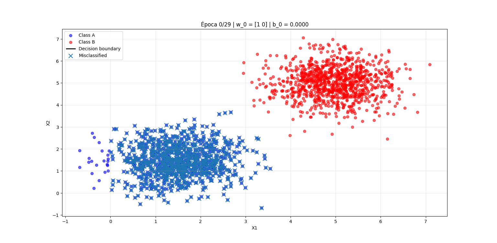
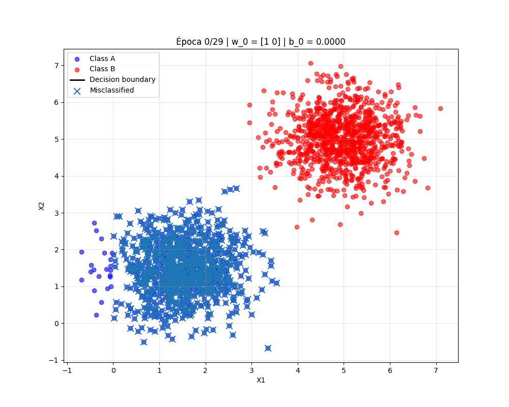
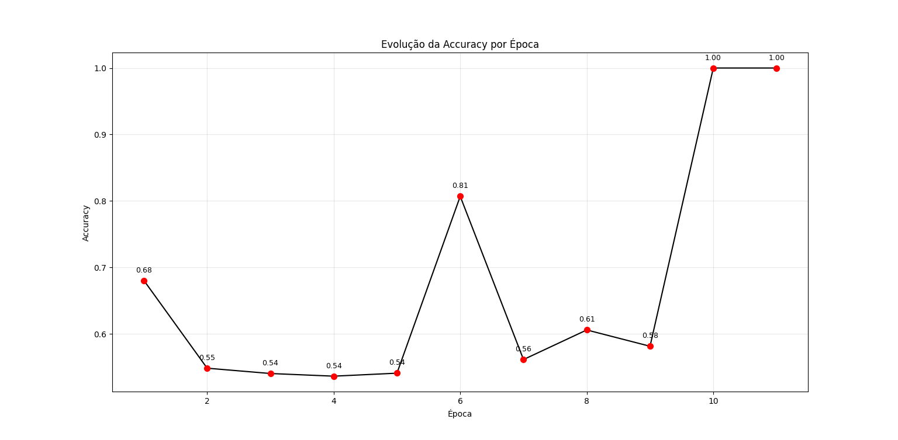
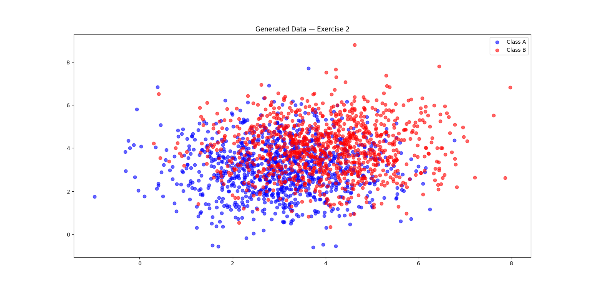
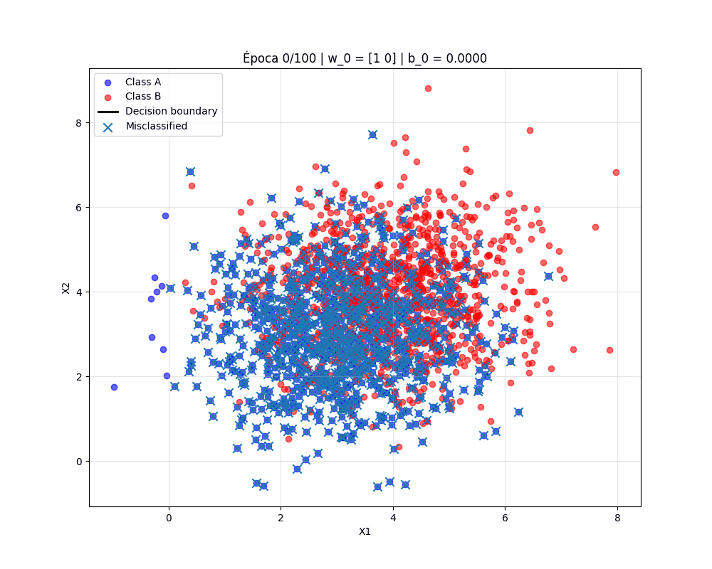
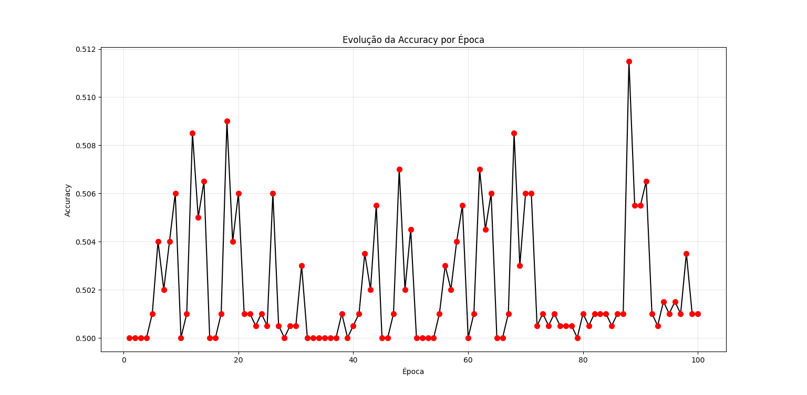

# Activity: Understanding Perceptrons and Their Limitations

???+ info inline end "Edição"

    2025.2

---

## Exercise 1 — Linearly Separable Data

### Data Generation

Generated **2D dataset** with 1000 samples per class using Gaussian distributions:

- **Class 0:** Mean = [1.5, 1.5], Covariance = [[0.5, 0], [0, 0.5]]
- **Class 1:** Mean = [5, 5], Covariance = [[0.5, 0], [0, 0.5]]

```python
import numpy as np
import matplotlib.pyplot as plt

np.random.seed(42)

mean_A = np.array([1.5, 1.5])

Sigma_A = np.array(
    [
        [0.5, 0],
        [0, 0.5],
    ]
)

mean_B = np.array([5, 5])

Sigma_B = np.array(
    [
        [0.5, 0],
        [0, 0.5],
    ]
)

ptsA = np.random.multivariate_normal(mean_A, Sigma_A, 1000)
ptsB = np.random.multivariate_normal(mean_B, Sigma_B, 1000)

plt.scatter(ptsA[:, 0], ptsA[:, 1], alpha=0.6, label="Class A", color="blue")
plt.scatter(ptsB[:, 0], ptsB[:, 1], alpha=0.6, label="Class B", color="red")
plt.legend()
plt.title("Generated Data — Exercise 1")
plt.show()
plt.close()
```

**Visualization:**  


---

### Perceptron Implementation

Implemented perceptron from scratch using the data generated above:

- Initialized weights `w` and bias `b`.
- Update rule: $w = w + η * (y - \hat{y}) * x$, $b = b + η * (y - \hat{y})$.
- Learning rate $η = 0.01$.
- Trained until convergence or 100 epochs.

```pyodide install="numpy,matplotlib"
import numpy as np

np.random.seed(42)

mean_A = [1.5, 1.5]
Sigma_A = [[0.5, 0], [0, 0.5]]
mean_B = [5, 5]
Sigma_B = [[0.5, 0], [0, 0.5]]

ptsA = np.random.multivariate_normal(mean_A, Sigma_A, 1000)
ptsB = np.random.multivariate_normal(mean_B, Sigma_B, 1000)

def activation_function(z):
    return 1 if z >= 0 else 0

Ya = np.zeros(len(ptsA), dtype=int)
Yb = np.ones(len(ptsB), dtype=int)

X = np.vstack([ptsA, ptsB])
Y = np.hstack([Ya, Yb])

w = np.array([1, 0])
b = 0
eta = 0.1
max_epochs = 100
iter = 1

for epoch in range(max_epochs):
    errors = 0
    for i, x in enumerate(X):
        y_pred = activation_function(float(w @ x + b))
        erro = Y[i] - y_pred
        if erro != 0:
            w = w + eta * erro * x
            b = b + eta * erro
            errors += 1
    if errors == 0:
        break
    iter += 1

print("Treinamento concluído.")
print("Resultados finais:")
print(f"Épocas percorridas: {iter} | w final = {w} | b final = {b:.4f}")
```

From the training, recorded weights, bias, and accuracy per epoch, I was able to visualize the decision boundary and the convergence process in an animation. The animation can be seen below:

## 

The perceptron accuracy per epoch was also tracked and plotted. The accuracy reached 100% quickly due to the linear separability of the data. Below is the accuracy plot:

## 

### Results

- **Epochs Passed:** 11
- **Final Weights:** w = [0.27536592 0.16377714]
- **Final Bias:** b = -1.5
- **Accuracy:** 100%

**Analysis:**  
The data is linearly separable, with two well-defined clusters and little overlap. Because a single straight line can clearly divide the classes, the perceptron converges quickly, requiring only a few updates to adjust its weights and reach perfect classification.

---

## Exercise 2 — Overlapping Classes

### Data Generation

Generated **2D dataset** with partial overlap:

- **Class 0:** Mean = [3, 3], Covariance = [[1.5, 0], [0, 1.5]]
- **Class 1:** Mean = [4, 4], Covariance = [[1.5, 0], [0, 1.5]]

```python
import numpy as np
import matplotlib.pyplot as plt

np.random.seed(42)

mean_A = np.array([3, 3])

Sigma_A = np.array(
    [
        [1.5, 0],
        [0, 1.5],
    ]
)

mean_B = np.array([4, 4])

Sigma_B = np.array(
    [
        [1.5, 0],
        [0, 1.5],
    ]
)

ptsA = np.random.multivariate_normal(mean_A, Sigma_A, 1000)
ptsB = np.random.multivariate_normal(mean_B, Sigma_B, 1000)

plt.scatter(ptsA[:, 0], ptsA[:, 1], alpha=0.6, label="Class A", color="blue")
plt.scatter(ptsB[:, 0], ptsB[:, 1], alpha=0.6, label="Class B", color="red")
plt.legend()
plt.title("Generated Data — Exercise 2")
plt.show()
plt.close()
```

**Visualization:**  


---

### Perceptron Implementation

To this second test, I followed the same training process.

- Maximum 100 epochs.
- Observed possible oscillation due to overlap.
- Recorded best accuracy over multiple runs.

```pyodide install="numpy,matplotlib"
import numpy as np

np.random.seed(42)

mean_A = np.array([3, 3])

Sigma_A = np.array(
    [
        [1.5, 0],
        [0, 1.5],
    ]
)

mean_B = np.array([4, 4])

Sigma_B = np.array(
    [
        [1.5, 0],
        [0, 1.5],
    ]
)

ptsA = np.random.multivariate_normal(mean_A, Sigma_A, 1000)
ptsB = np.random.multivariate_normal(mean_B, Sigma_B, 1000)

ptsA = np.random.multivariate_normal(mean_A, Sigma_A, 1000)
ptsB = np.random.multivariate_normal(mean_B, Sigma_B, 1000)

def activation_function(x):
    return 1 if x >= 0 else 0

Ya = np.zeros(len(ptsA), dtype=int)
Yb = np.ones(len(ptsB), dtype=int)

X = np.vstack([ptsA, ptsB])
Y = np.hstack([Ya, Yb])

w = np.array([1, 0])
b = 0
eta = 0.1
max_epochs = 100
hist = [(w.copy(), b)]

for epoch in range(max_epochs):
    errors = 0
    for i, x in enumerate(X):
        y_pred = activation_function(float(w @ x + b))
        erro = Y[i] - y_pred
        if erro != 0:
            w = w + eta * erro * x
            b = b + eta * erro
            errors += 1
    hist.append((w.copy(), b))

    if errors == 0:
        break

print("Treinamento concluído.")
print("Resultados finais:")
print(f"Épocas percorridas: {len(hist)-1} | w final = {w} | b final = {b:.4f}")
```

Similar to Exercise 1, I visualized the decision boundary and convergence process in an animation. The animation can be seen below:



The perceptron accuracy per epoch was also tracked and plotted. The accuracy never quite reached a stable accuracy due to the overlap in the data. Below is the accuracy plot:



### Results

- **Epochs Passed:** 100
- **Final Weights:** [0.36998284 0.25593958]
- **Final Bias:** -0.2000
- **Mean Accuracy:** 50.21%

As a convergence was not achieved, I ran the training 5 times and recorded the mean accuracy obtained.

```pyodide install="numpy,matplotlib"
import numpy as np

def activation_function(x):
    return 1 if x >= 0 else 0

eta = 0.1
max_epochs = 100

final_accuracies = []

for run in range(5):
    mean_A = np.array([3, 3])
    Sigma_A = np.array([[1.5, 0], [0, 1.5]])
    mean_B = np.array([4, 4])
    Sigma_B = np.array([[1.5, 0], [0, 1.5]])

    ptsA = np.random.multivariate_normal(mean_A, Sigma_A, 1000)
    ptsB = np.random.multivariate_normal(mean_B, Sigma_B, 1000)

    Ya = np.zeros(len(ptsA), dtype=int)
    Yb = np.ones(len(ptsB), dtype=int)

    X = np.vstack([ptsA, ptsB])
    Y = np.hstack([Ya, Yb])

    w = np.array([1.0, 0.0])
    b = 0.0
    hist = [(w.copy(), b)]

    for epoch in range(max_epochs):
        errors = 0
        for i, x in enumerate(X):
            y_pred = activation_function(float(w @ x + b))
            erro = Y[i] - y_pred
            if erro != 0:
                w = w + eta * erro * x
                b = b + eta * erro
                errors += 1
        hist.append((w.copy(), b))

        if errors == 0:
            break

    y_pred_final = (X @ w + b >= 0).astype(int)
    acc = (y_pred_final == Y).mean()
    final_accuracies.append(acc)

    print(f"Run {run+1}: epochs={len(hist)-1}, accuracy={acc:.3f}")

print("\nAccuracies finais das 5 execuções:", final_accuracies)
print("Média:", np.mean(final_accuracies))
```

**Analysis:**  
The heavy overlap between the two classes prevents the perceptron from finding a clear linear separator. As a result, the training accuracy fluctuates around 50%, as shown in the plot and by those 5 executions above. The continuous misclassifications in the overlapping region force repeated weight updates, which cause oscillation without convergence. This highlights the limitation of perceptrons: they cannot achieve meaningful accuracy when data is not linearly separable.

---

## References

- [Numpy Documentation - multivariate_normal](https://numpy.org/doc/2.2/reference/random/generated/numpy.random.multivariate_normal.html)
- [ANN-DL Course - Perceptron](https://insper.github.io/ann-dl/classes/perceptron/main)
- Report (Text correction and adaptation to english) and perceptron animation support generated with assistance from ChatGPT.
